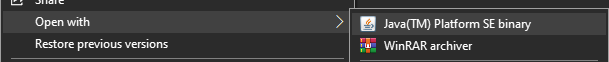

# trivia-assessment

An API for presenting and validating trivia questions.

## running the API
1. ``git clone https://github.com/MrrrLuiigii/trivia-assessment.git``
2. right click ``trivia-assessment-0.0.1-SNAPSHOT.jar`` file
3. open with > Java(TM) Platform SE binary
   1. 

## using the API (e.g. with postman)
1. [GET] localhost:8080/generate
2. [GET] localhost:8080/questions
3. [POST] localhost:8080/checkanswer
   ``{
   "questionId": <<insert id(int)>>,
   "answer": "<<insert answer(string)>>"
   }``